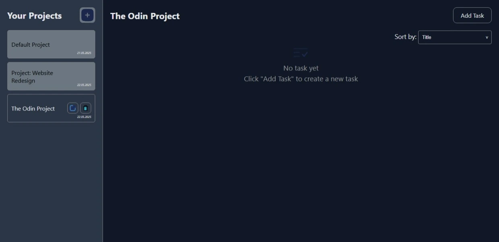

# todo-list-odin

## The Todo List Application

**Project Odin | Todo List**

### Overview

This project is a fully modular Todo List application that separates application logic from DOM manipulation using factories/classes. The design emphasizes maintainability and scalability by organizing functionality into dedicated modules.

### Features

#### Modular Architecture

- **Separation of Concerns:**  
  Application logic is decoupled from DOM-related code. Todo items are created using factories or classes with properties such as:
  - **title**
  - **description**
  - **dueDate**
  - **priority**
  - **notes**
  - **checklists**
- **Modular Structure:**  
  The project is organized into multiple modules:
  - `renderProjects`
  - `renderTasks`
  - `TaskService`
  - `ProjectService`
  - `modalControl`
  - `modalHelpers`
  - Dedicated form handlers

#### Project and Todo Management

- **Default Project:**  
  A default project is created on first load to store todos.
- **Project-Specific Todos:**  
  Todos are linked to specific projects so that switching between projects displays only their respective tasks.
- **Multiple Projects:**  
  Users can create and manage additional projects to organize their todos effectively.

#### Dynamic Rendering & Modal Interface

- **Dynamic Rendering:**  
  Render functions dynamically display projects and their associated todos.
- **Modal Interfaces:**  
  Separate modals are implemented for adding/editing projects and todos, with dynamic header updates reflecting the current mode (add/edit).

#### LocalStorage Persistence

- **Data Persistence:**  
  Projects and todos are saved using the localStorage Web Storage API, ensuring data persists even after a page refresh.
- **Data Validation:**  
  The app gracefully handles cases where localStorage data may be missing or incomplete.

#### Enhanced Functionality

- **Date Management:**  
  Uses the `date-fns` library to format and manipulate dates according to locale.
- **Sorting Options:**  
  Implements sorting based on due date, title, priority, and completion status.
- **Empty State Component:**  
  Displays a designated "empty" state when the active project has no tasks.

### Project Screenshots

  
  

### Original Assignment

For more detailed instructions, refer to the original assignment on [The Odin Project](https://www.theodinproject.com/lessons/node-path-javascript-todo-list).

### Conclusion

This project showcases a robust, modular approach to developing a Todo List app, highlighting clean code separation, dynamic rendering, and user-centric features like sorting and persistence.
